# **Meets**
**Meet new people, make new connections with Meets!**

***Meets*** is a social media app that allows users to connect with others who share similar interests and hobbies. Whether you're looking to make new friends, find a workout buddy, or meet someone special, ***Meets*** makes it easy to connect with like-minded individuals in your area. With features such as image sharing, commenting, and personal profiles, ***Meets*** is the perfect platform for building meaningful relationships and expanding your social circle. So why wait? Visit [Meets.com](https://meets.herokuapp.com/) today and start meeting new people!

## Live Site
[www.meets.com](https://meets.herokuapp.com/)

## Live Drf Api
[drf-api99.com](https://drf-api99.herokuapp.com/)

## Repositories
[Meets Repository](https://github.com/Madebybrown/meets)

[Drf-api Repository](https://github.com/Madebybrown/drf-api)

# **Features**

- **Navigation Bar**
    - Visible on all pages to make it easy for the user to navigate between pages, displays different options if you logged in or logged out.

*Logged Out*
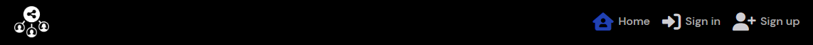
*Logged in*

- **Sign Up Page**
    - Allows users to sign up and create an account to reap the benefits of more useful features when logged in.

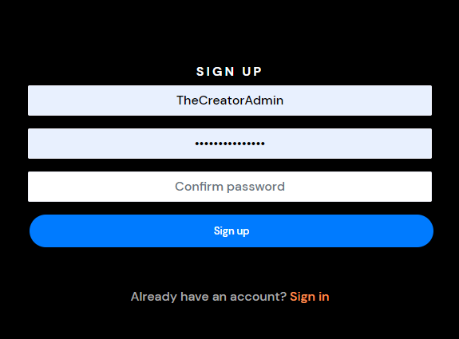

- **Sign In Page**
    - Allows users to sign in.

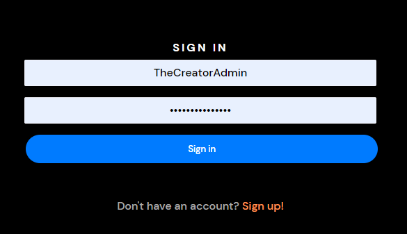

- **Popular Profiles**
    - Displays the profiles with the most followers, a cool feature to allow users to easily access the most followed profiles.

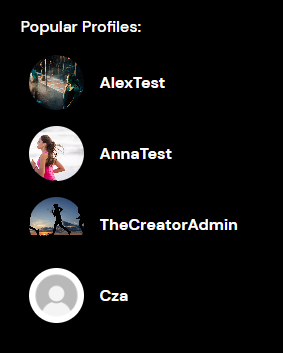

- **Follow / Unfollow**
    - Gives the user the option to follow or unfollow other users.

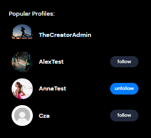

- **Profile Page**
    - The users' profile page, shows how many posts a user has created, how many followers they have, and how many profiles they are following, it also displays a "bio" section and all the posts the user has posted underneath.

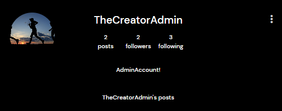

- **Edit Profile**
    - The user has the option to edit their profile bio, image, username, and password.

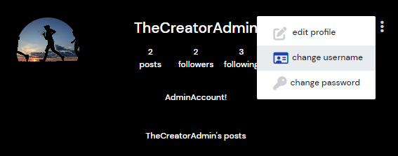

**Edit profile bio and image**
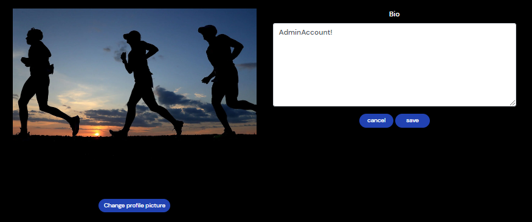

**Edit username**  

**Edit password**  
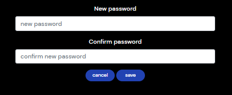

**Add posts**
-  A feature to let the user upload images with titles and captions.

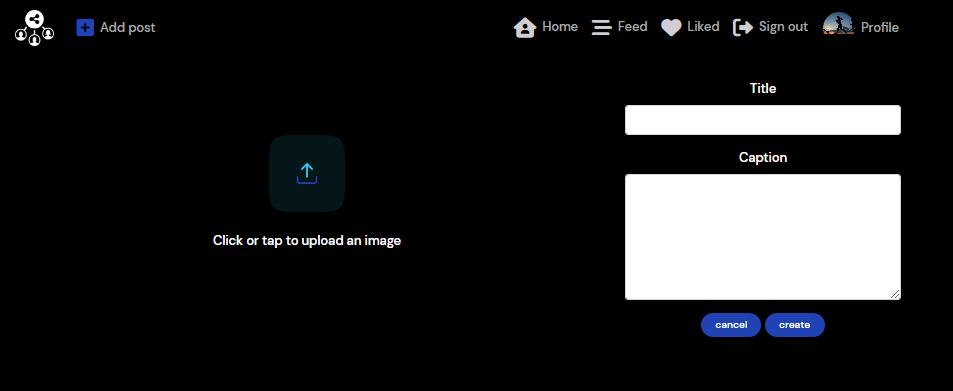

**Edit posts**
-  A feature to let the user edit their uploaded posts.

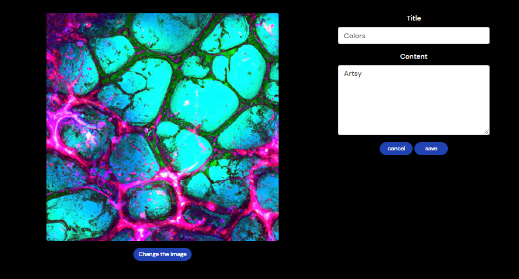

**Add Post Comments and likes**
- Users can view each other posts and leave comments and likes.

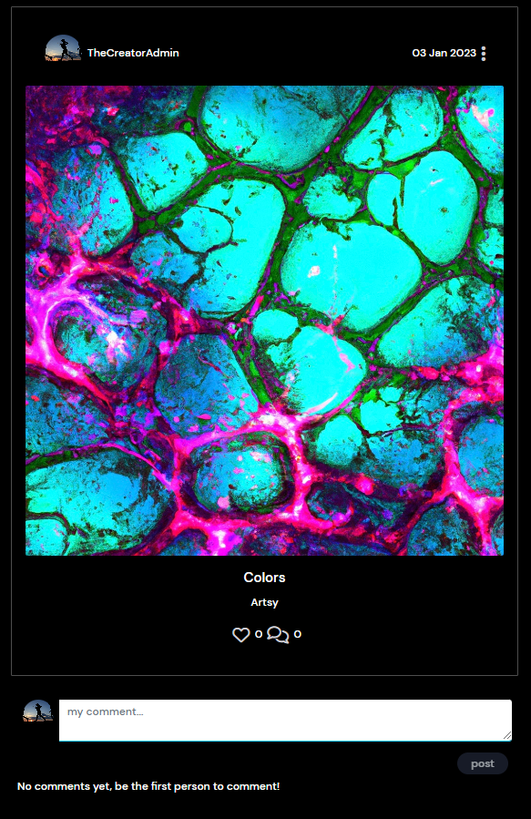

# **Features left to implement**
- Private chat
- Bookmarking images
- Delete/Pause personal account
- Security check before deleting a post Example: *"Are you sure you want to delete this post?"*

# **Testing**

## **Sign Up** | 

1 - The feature is expected to prompt the user to insert a username and password when the user tries to sign up without entering a username and password.
    
- *Tested the feature by trying to sign up without entering a username and a password.*

- *The feature acted as expected and prompted the user to insert a username and a password.*

2 - The feature is expected to take the user to the sign-in page when clicked if the fields are filled with a valid username and password.

- *Tested the feature by trying to sign up with an authorized username and password*.

- *The feature acted as expected and took the user to the sign-in page.*

## **Sign In** | 

1 - The feature is expected to prompt the user to insert a valid username and password when the user tries to sign in without entering a username and password.
    
- *Tested the feature by trying to sign in without entering a username and a password.*

- *The feature acted as expected and prompted the user to insert a username and a password.*

2 - The feature is expected to take the user to the home page when clicked if the fields are filled with an authorized username and password.

- *Tested the feature by trying to sign in with an authorized username and password*.

- *The feature acted as expected and took the user to the home page.*

## **Add Post** | 

1 - The feature is expected to prompt the user to insert a title and an image when the user tries to create a post without entering a title and an image.
    
- *Tested the feature by trying to create a post without entering a title and an image.*

- *The feature acted as expected and prompted the user to insert a title and an image.*

2 - The feature is expected to take the user to the uploaded posts page when "create" is clicked if the fields are filled with a valid title and image.

- *Tested the feature by trying to create a post with a valid title and image*.

- *The feature acted as expected and took the user to the uploaded posts page.*

## **Delete Post** | 

1 - The feature is expected to delete a post when clicked.
    
- *Tested the feature by trying to delete a post.*

- *The feature acted as expected and deleted a post.*

## **Edit Post** | 

1 - The feature is expected to take the user to the edit post page.
    
- *Tested the feature by trying to click the edit icon.*

- *The feature acted as expected and took the user to the edit post page.*

## **Edit Post Page** | 

1 - The feature is expected to prompt the user to insert a title if the user tries to edit a post by removing the title.
    
- *Tested the feature by trying to edit a post by removing the title.*

- *The feature acted as expected and prompted the user to insert a title.*

2 - The feature is expected to take the user to the uploaded posts page when "save" is clicked if the fields are filled with a valid title.

- *Tested the feature by trying to create a post with a valid title*.

- *The feature acted as expected and took the user to the uploaded posts page.*

## **Post Comments** | 

1 - The feature is expected to do nothing if the user tries to post a comment without any text content.
    
- *Tested the feature by trying to create an empty comment.*

- *The feature acted as expected and did nothing.*

2 - The feature is expected to post a comment if the comment field is filled with text.

- *Tested the feature by trying to create a comment with text content*.

- *The feature acted as expected and created a comment under the picture.*

## **Follow / Unfollow** | 

1 - The feature is expected to update and *increase* the followers count of the following user and the following count of the account owner pressing follow.
    
- *Tested the feature by trying to follow an account.*

- *The feature acted as expected and updated the fields accordingly.*

2 - The feature is expected to update and *decrease* the followers count of the unfollowed user and the following count of the account owner pressing unfollow.
    
- *Tested the feature by trying to unfollow an account.*

- *The feature acted as expected and updated the fields accordingly.*

## **Like / Unlike Posts** | 

1 - The feature is expected to update and *increase* the like count of the post being liked and add the post to the users' liked section in the navbar.
    
- *Tested the feature by trying to like a post.*

- *The feature acted as expected updated the fields accordingly and added the post to the liked section.*

2 - The feature is expected to update and *decrease* the like count of the post and remove the post from the liked section.
    
- *Tested the feature by trying to unlike a post.*

- *The feature acted as expected, updated the fields accordingly, and removed the post from the like section.*

## **Search Posts** | 

1 - The feature is expected to filter posts by usernames and titles when used.
    
- *Tested the feature by trying to filter posts.*

- *The feature acted as expected and updated the posts accordingly.*

# **Deployment**
The project was deployed using Heroku.
 - Steps for deployment:
    - First, when on the Heroku dashboard, click new up to your right-hand side, this will toggle a drop down.
    - Click on "Create new app", this will take you to a new page.
    - Here you choose your app name, and your region, and then you click "Create app" down on the left-hand side, this will take you to a new page.
    - On this page, you first click on the settings tab.
    - Here you scroll down until you see the button with "Reveal Config Vars" on it, click it!
    - Write your environment variables here and press add. 
    - Now scroll up to the top of the page and press the "Deploy" tab and then press GitHub.
    - Search for the repository you want to deploy.
    - Press connect.
    - Scroll down until you find "Enable Automatic Deploys" and "Deploy Branch", press them, and wait while your app is building.
    - Building app
    - App build is finished

# **User Stories**
## **Navigation & Authentication**
1. Navigation: As a user, I can view a navigation bar from every page to easily navigate between pages.
2. Routing: As a user, I can quickly navigate through pages to view content seamlessly without page refresh.
3. Authentication:
- Sign up: As a user, I can create a new account to access all features for signed-up users.
- Sign-in: As a user, I can sign in to the app to access functionality for logged-in users.
- Logged-in status: As a user, I can determine if I am logged in or not to log in if necessary.
- Refreshing access tokens: As a user, I can maintain my logged-in status until I choose to log out to ensure my user experience is not compromised.
7. Conditional rendering: As a logged-out user, I can see sign-in and sign-up options to access the app.
8. Avatar: As a user, I can view other users' avatars to easily identify them in the application.

## **Adding & Liking Posts**
1. Creating posts: As a logged-in user, I can create posts to share my images with the world.
2. Viewing a post: As a user, I can view the details of a single post to learn more about it.
3. Liking a post: As a logged-in user, I can like a post to show my support for posts that interest me.

## **The Posts Page**
1. Viewing most recent posts: As a user, I can view all the most recent posts, ordered by most recently created first, to stay up to date with the newest content.
2. Searching for posts: As a user, I can search for posts with keywords to find posts and user profiles of interest.
3. Viewing liked posts: As a logged-in user, I can view the posts I liked to find the posts I enjoy the most.
4. Viewing posts of followed users: As a logged-in user, I can view content filtered by users I follow to stay up to date with their posts.
5. Infinite scrolling: As a user, I can keep scrolling through the images on the site that are automatically loaded for me to easily view more content.

## **The Post Page**
1. Viewing the posting page: As a user, I can view the posting page to read comments about the post.
2. Editing a post: As a post owner, I can edit my post title and description to make corrections or updates.
3. Adding a comment: As a logged-in user, I can add comments to a post to share my thoughts.
4. Viewing comment date: As a user, I can see how long ago a comment was made to understand its age.
5. Reading comments: As a user, I can read comments on posts to learn what other users think about them.
6. Deleting comments: As an owner of a comment, I can delete my comment to control its removal from the application.
7. Editing a comment: As an owner of a comment, I can edit my comment to fix or update it.

## **The Profile Page**
1. Viewing user profiles: As a user, I can view other users' profiles to see their posts and learn more about them.
2. Viewing most followed profiles: As a user, I can see a list of the most followed profiles to see which profiles are popular.
3. Viewing user stats: As a user, I can view statistics about a specific user, including their bio, number of posts follows, and users followed, to learn more about them.
4. Following/unfollowing a user: As a logged-in user, I can follow and unfollow other users to see and remove posts by specific users in my feed.
5. Viewing all posts by a specific user: As a user, I can view all the posts by a specific user to catch up on their latest posts or decide if I want to follow them.
6. Editing a profile: As a logged-in user, I can edit my profile to change my profile picture and bio.
7. Updating username and password: As a logged-in user, I can update my username and password to change my display name and keep my profile secure.

# **Components Understanding**
In the React architecture, components are the building blocks of a user interface. They are reusable pieces of code that can be used to represent a part of a user interface in a declarative and reusable way.

One of the key benefits of using components in React is that they can be easily reused throughout an application. This helps to reduce the amount of code that needs to be written and maintained, as well as make it easier to update and modify the user interface as needed.

There are a few different ways that components can be reused in a React application:

1. Reusing a component within a single component tree: A component can be reused within the same component tree by rendering it multiple times with different props (short for properties). This is often done to render a list of items, for example.

2. Reusing a component across different component trees: A component can be exported from one component tree and imported into another component tree, allowing it to be used in multiple places within an application.

3. Reusing a component across different applications: A component can be published to a package manager such as npm, allowing it to be easily shared and reused across different React applications.

Overall, the reuse of components is a key part of the React architecture and helps to make it easier to build and maintain user interfaces.

# **Technologies Used**
- HTML, CSS, JavaScript
- React.js
- Bootstrap.js
- Django REST Framework

# **Credits**
- Code institute - Django REST Framework
- Code institute - Moments

## [Back To The Top](#meets)