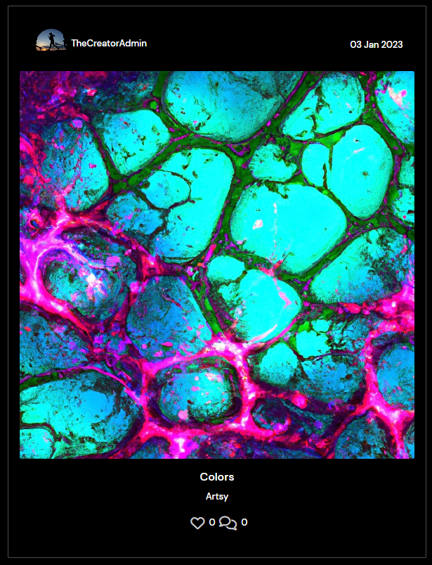

# **Meets**
**Meet new people, make new connections with Meets!**

***Meets*** is a social media app that allows users to connect with others who share similar interests and hobbies. Whether you're looking to make new friends, find a workout buddy, or meet someone special, ***Meets*** makes it easy to connect with like-minded individuals in your area. With features such as image sharing, commenting, and personal profiles, ***Meets*** is the perfect platform for building meaningful relationships and expanding your social circle. So why wait? Visit [Meets.com](https://meets.herokuapp.com/) today and start meeting new people!

# **Features**

- **Navigation Bar**
    - Visible on all pages to make it easy for user to navigate between pages, displays different options if your logged in or logged out.

*Logged Out*

*Logged in*

- **Sign Up Page**
    - Allows users to sign up and create an account to reap the benefits of more useful features when logged in.

- **Sign In Page**
    - Allows users to sign in.

- **Popular Profiles**
    - Displays the profiles with the most followers, a cool feature to allow users to easily access the most followed profiles.

- **Profile Page**
    - The users personal profile page, shows how many posts a user has created, how many followers they have and how many profiles they are following, it also displays a "bio" section and all the posts the user has posted underneath.

- **Edit Profile**
    - The user has the option to edit their profile bio, image, username and password.

**Edit profile bio and image**

**Edit username**  

**Edit password**  

**Add posts**
-  A feature to let the user upload images with titles and captions.

**Edit posts**
-  A feature to let the user edit their uploaded posts.

**Posts**
-  Let's other users see the uploaded posts so they can leave a comment and a like.

**Add Post Comment**
-  

# **Features left to implement**
- Private chat function
- Bookmark images feature
- Delete/Terminate personal account feature

# **Testing**

# **Deployment**

# **Credits**